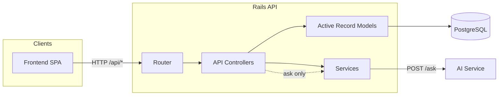
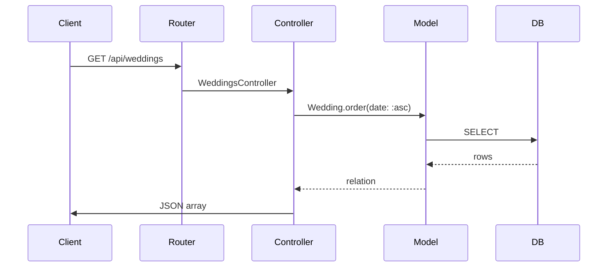
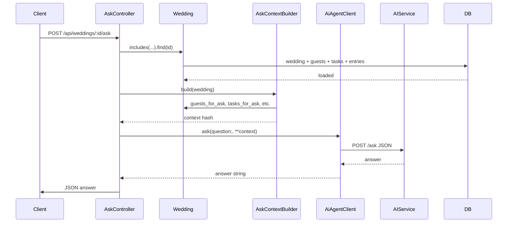
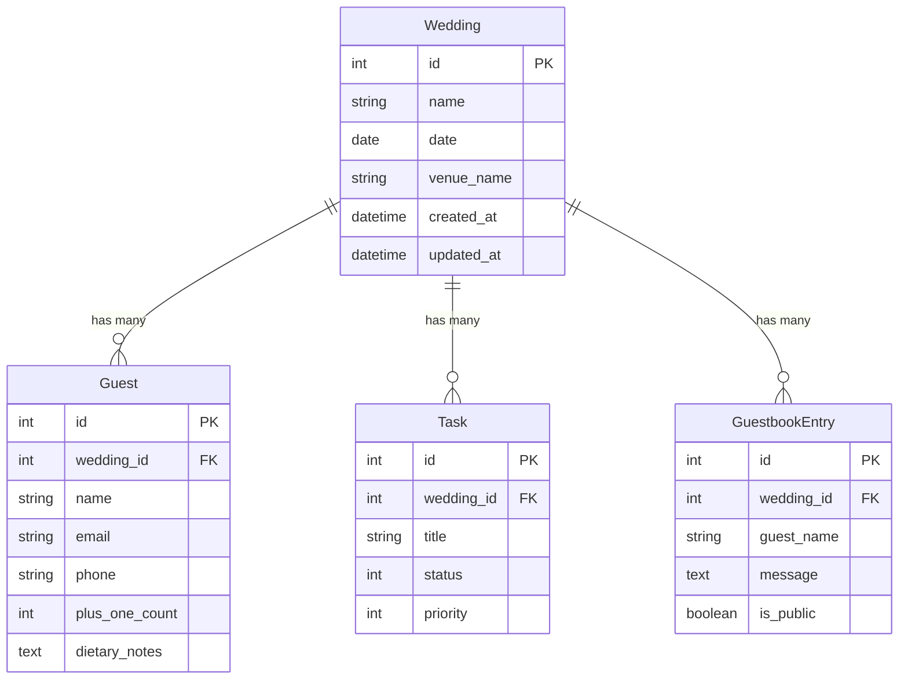

# Wedding AI Rails API

API-only Rails backend for the wedding coordination dashboard.

## Architecture



- **Router** → `config/routes.rb`: mounts `/api` namespace (weddings, guests, tasks, guestbook_entries, ask).
- **API Controllers** → CRUD + `AskController`; all inherit `Api::BaseController` (404, validation error handling).
- **Models** → Wedding, Guest, Task, GuestbookEntry; all DB access via Active Record (scopes, no raw SQL).
- **Services** → `AskContextBuilder` (builds context hash from a Wedding), `AiAgentClient` (HTTP to AI service).

## Request flow (typical CRUD)



## Ask flow (AI Q&A)



## Data model



## Endpoints

- `GET /api/weddings`
- `POST /api/weddings`
- `GET /api/guests`
- `POST /api/guests`
- `GET /api/guestbook_entries`
- `POST /api/guestbook_entries`
- `GET /api/tasks`
- `POST /api/tasks`
- `PATCH /api/tasks/:id`
- `POST /api/weddings/:wedding_id/ask` (delegates to Python AI service)

## Environment

Copy and edit:

```bash
cp .env.example .env
```

Important variables:

- `DB_HOST`, `DB_PORT`, `DB_USERNAME`, `DB_PASSWORD`, `DB_NAME`
- `FRONTEND_ORIGINS` (comma-separated list, e.g. `http://localhost:5173,http://localhost:8080`)
- `AI_SERVICE_URL` (e.g. `http://ai-service:8000` in compose)

## Local run (without Docker)

```bash
bundle install
bin/rails db:prepare
bin/rails db:seed
bin/rails server -p 3000
```
